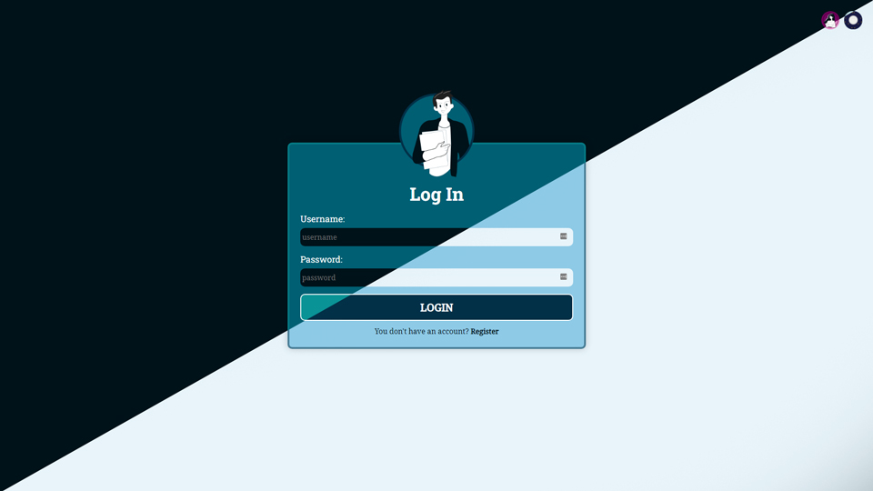
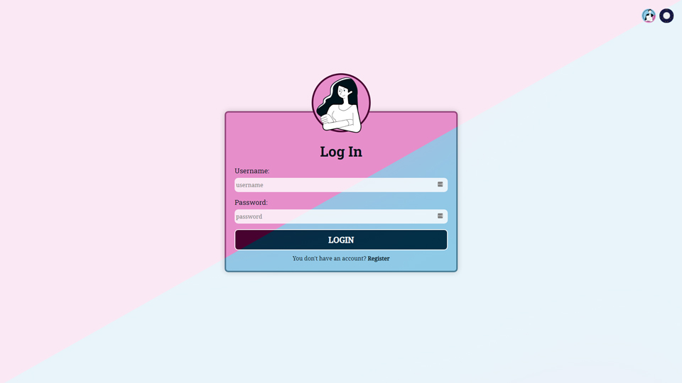
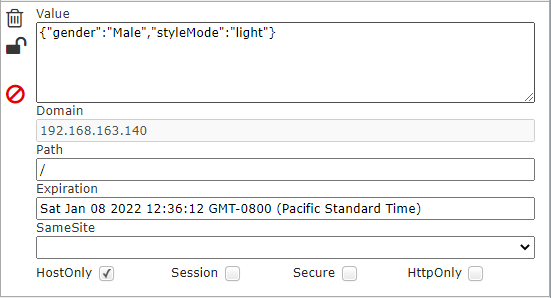
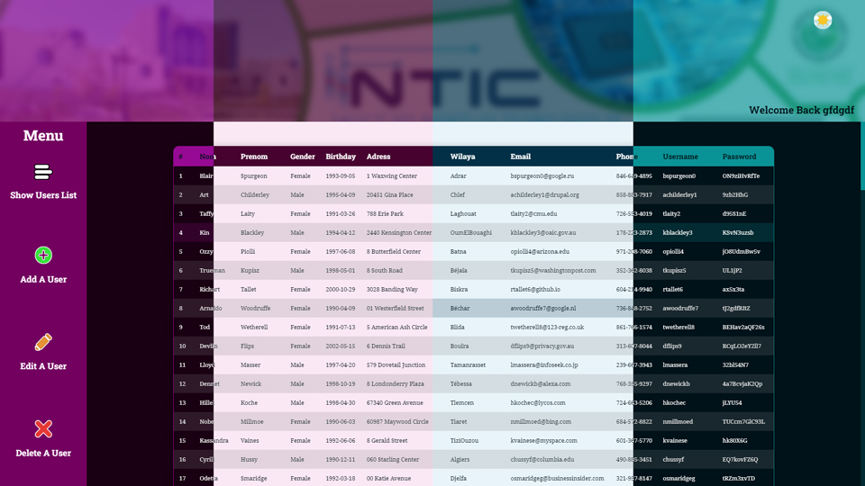
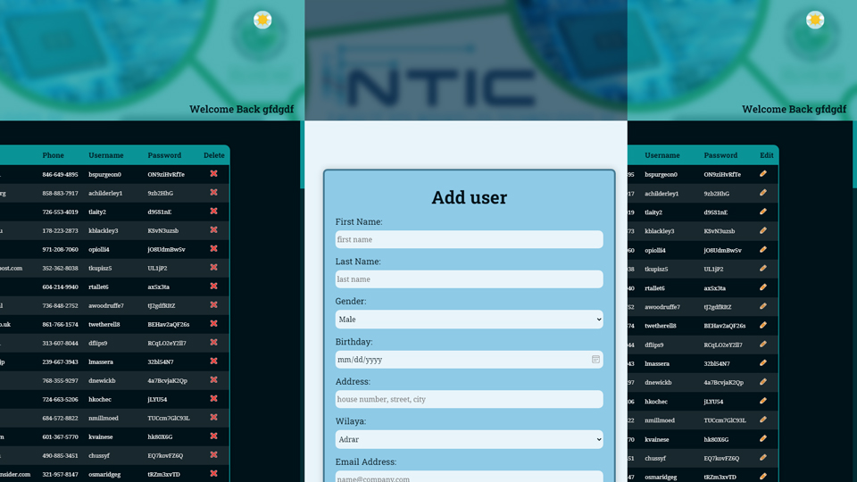

# TP 01: TP 1 : HTML , CSS and JavaScript Project Rapport.

By **Oussama SALAHOUELHADJ** and **Mohamed Elhadi SAOUDI** | L3-GL | Groupe 02 | 19/11/2021

## Table of content:

- [TP 01: TP 1 : HTML , CSS and JavaScript Project Rapport.](#tp-01-tp-1--html--css-and-javascript-project-rapport)
  - [Table of content:](#table-of-content)
  - [TP:](#tp)
  - [Preface:](#preface)
  - [About our project:](#about-our-project)
  - [Hosting](#hosting)
  - [Project files & folders Structure:](#project-files--folders-structure)
  - [Getting started:](#getting-started)
    - [Node.js](#nodejs)
    - [NPM](#npm)
    - [Running the Application](#running-the-application)
  - [Whats in Student Absences Manager](#whats-in-student-absences-manager)
    - [`index.html` :](#indexhtml-)
    - [`creeCompte.html` :](#creecomptehtml-)
    - [`accueil.html` :](#accueilhtml-)
  - [Application Features:](#application-features)
  - [Finally...](#finally)

## TP:

TP 01 can be found in this [link](https://drive.google.com/file/d/1apzEYagRSvj2BDQRe1_l7x6aEEGYXfFD/view?usp=sharing).

## Preface:

HTML , CSS et JavaScriptJavascript are the modern best choice for Web applications (front-end at least), even if it is not pure JS for example, using frameworks will at the end compile to JS, for that this TP became handy to help discover our knowldge in this languages and to apply our best practices in writing code.

## About our project:

Our project (\*called **Student Absences Manager\***) is a website that supposed to manage list of users: Adding, editing, deleting..., with some additional functionalities.
in this project we used a lot of HTML, CSS and Javascript concepts and functionalities: fetching data, cookies, Event Listeners, grid, flex, css variables...

## Hosting

This website is hosted on Firebase: [studentabsencesmanager.web.app](https://studentabsencesmanager.web.app/)

## Project files & folders Structure:

The Project files & folders Structure are arranged to be consistant:
html pages in ./pages, JS scripts in ./scripts ...

The Structure tree looks like this:

```txt
ª   .gitignore
ª   index.html
ª   README.MD
ª   tree.txt
ª
+---assets
ª   +---data
ª   ª       registerFormData.json
ª   ª       users.json
ª   ª
ª   +---images
ª           add-icon.png
ª           dark-mode.png
ª           delete-icon.png
ª           edit-icon.png
ª           light-mode.png
ª           student_dark_Female.png
ª           student_dark_Female_ce.png
ª           student_dark_Male.png
ª           student_dark_Male_ce.png
ª           student_light_Female.png
ª           student_light_Female_ce.png
ª           student_light_Male.png
ª           student_light_Male_ce.png
ª           student_Male.png
ª           student_Male_ce.png
ª           UnivCons2.gif
ª
+---css
ª       accueil.css
ª       style.css
ª
+---pages
ª       accueil.html
ª       creerCompte.html
ª
+---scripts
    ª   accueil.js
    ª   app.js
    ª   logIn.js
    ª   register.js
    ª
    +---gen
            check_and_add_edit.js
            initInputEventListener.js
            initPage.js
            pageControl.js
            submitButtonClicked.js

```

## Getting started:

Using some JS functionalities makes it impossible to just execute/open the HTML files on the browsers, functionalities like fetching data from a file and calling browser's cookies.

The solution is to run a local server so you need to install `node`, `npm` to be able to run the `npm` package `live-server`:

### Node.js

First, make sure that you have Node.js installed. you can install it as any other installable application,[ official Node.js website](https://nodejs.org/en/) to download it.

### NPM

Once you installed node check that npm is also installed:

```
$ npm --version
> 8.1.0 /* installed successfully */
```

### Running the Application

now you have `npm` you can run the below command to run the website:

```
$ npm live-server /* make sure to run it on the folder root directory '/StudentListWebsite' */
```

A localhost port must be open and a new browser Tab with the website opens.

## Whats in Student Absences Manager

### `index.html` :

This is the base app page, it is the first page that will appear when running the project, it shows some the application features such as the light/dark mode toggle, male/female toggle and a **logIn Form** with a username and password fields.

### `creeCompte.html` :

In this page we implimented the **Register Form** with these fields: **_First Name, Last Name, Gender, Birthday, Address, Wilaya, Email, Phone Number, Username and password._**.
this pages shows a really important concept that we used and will showcase it later in this rapport: **`Regular Expressions`** and **`OOP in Javascript`**.

### `accueil.html` :

`accueil.html` is the main page where we can Show users List, Add, Edit and delete users it is the play ground for the final client, also in this page we used some concepts like reusability...

these three pages are moderated by a strong Javascript files in `/StudentListWebsite/scripts` and `../StudentListWebsite/scripts/gen` where gen stands for general reusable functions.

not to forget to mention the nice UI/UX that was implimented from scratch.

## Application Features:

In this section will show the application features in detail and explain the how it works, implimentation and the objectif of it. starting from the `index.html`, then `creeCompte.html` finally `acceuil.html`.

1. Dark/Light Mode:

   

   Dark/Light Mode is design/UI feature that is simple, beatuful but it's implimentation must be consist and it is a bit tricky, for that we used css variables for colors and a JS event listener to change the theme once clicked on the dark/light mode button in the top right of every page.

2. Male/Female Style Mode:

   

   Similar to Dark/Light Mode the Male/Female Mode changes the color tone by gender, the gender of the user, when the user register for the first time when choosing gender, a trigger will fire to set the default tone

   for this feature and the previous one we need a place where we save the variables, this place must stay after closign the app and be different from a user to another one, the best fit is **`Browser Cookies`**.

3. Using cookies:

   by calling `window.cookie` we can save some info about the preferances of the user so it has not to set them every time using the app (flex, dynamic and easy use).

   we implimented cookies to store the two previous features.

   

4. Data and fetch:

   websites usally get their data from servers or databases via API/RESTful API, but as this Project is just with HTML , CSS and JavaScript, we implimented our own Database stored as JSON files, to get data from a local file in Js we have to use another concept: Async and Await, and that what we implimented to read data from owr humble DB.

   two JSON objects stored in users.json:

   ```JSON
   [{"id": "cd7659c7-890c-4ab8-ae8e-8395317a9621",
   "firstName": "Blair",
    "lastName": "Spurgeon",
    "gender": "Female",
    "birthday": "1993-09-05",
    "adress": "1 Waxwing Center",
    "wilaya": "Adrar",
    "email": "bspurgeon0@google.ru",
    "phone": "846-649-4895",
    "username": "bspurgeon0",
    "password": "ON9ziHvRfTe"
    }, {
    "id": "29fa3887-2e7a-4f23-afca-b02dda5c6b2a",
    "firstName": "Art",
    "lastName": "Childerley",
    "gender": "Male",
    "birthday": "1995-04-09",
    "adress": "20451 Gina Place",
    "wilaya": "Chlef",
    "email": "achilderley1@drupal.org",
    "phone": "858-883-7917",
    "username": "achilderley1",
    "password": "9zb2HhG"
    }]

   ```

5. Regex and Input Validation:

   Regex stands for Regular Expressions a basic concept in patterns, used in different fields, Javascript as almost all programming languages impliment regex, usually used with text, search and validation.

   username and password regex implimentation used in this app:

   ```JS
   username: {
    ...
    validationRegex: /^((?!\s).)[a-z1-9]{4,15}$/i,
    ...
    validateValue: function () {
        return this.validationRegex.test(this.value.trim());
        },
   },
   ```

   ```JS
   password: {
   ...
   validationRegex: /\b.{6,50}\b$/,
   ...
     },
   },
   ```

6. OOP and Javascript

   the implimentation of the object oriented programming in Js is not that powerfull but javascript uses objects a lot as "every thing in Js is an object", we used OOP concepts in js to strenth, for example every form has an object that stores the input fields and some useful functions for that object.

   plus, every input field is an object in the form object and has: name, htmlElement, value, validationRegex, errorMessage and more...
   with this powerfull concept we can do any action on the form just by calling its Js object.

   OOP in JS exapmle:

   ```JS

    let logInForm = {
    name: "login-form",
    htmlElement: logInHtmlElem,
    logInInputFields: ["username", "password"],
    username: {
        name: "username",
        htmlElement: logInHtmlElem["username"],
        value: "",
        validationRegex: /^((?!\s).)[a-z1-9]{4,15}$/i,
        errorMessageDisplayed: false,
        errorMessage: "invalid username, must be between 4-15 character",
        validateValue: function () {
        return this.validationRegex.test(this.value.trim());
        },
    },
    password: {
        name: "password",
        htmlElement: logInHtmlElem["password"],
        value: "",
        validationRegex: /\b.{6,50}\b$/,
        errorMessageDisplayed: false,
        errorMessage: "invalid password, must be between 6-50 character",
        validateValue: function () {
        return this.validationRegex.test(this.value.trim());
        },
    },
    gender: {
        value: "Male",
    },
    checkInputValidity: function () {
        let elementsToCheckValue = this.logInInputFields;
        let areElementsValid = true;
        for (const element of elementsToCheckValue) {
        let formElement = this[element];
        formElement.value = formElement.value.trim();
        formElement.htmlElement.value = formElement.value;
        let isValid = formElement.validateValue();
        let isErrorMessageDisplayed = formElement.errorMessageDisplayed;

        if (!isValid && !isErrorMessageDisplayed) {
            this.fireInvalidInputErrorMessage(formElement);
            areElementsValid = false;
        } else if (isValid && isErrorMessageDisplayed) {
            this.removeInvalidInputErrorMessage(formElement);
        }
        if (!isValid && isErrorMessageDisplayed) {
            areElementsValid = false;
        }
        }

        return areElementsValid;
    },
    fireInvalidInputErrorMessage: function (formElement) {
        let errorMessageHtmlElement = document.createElement("p");
        errorMessageHtmlElement.classList.add("invalid-input-error-message");
        errorMessageHtmlElement.innerHTML = formElement.errorMessage;
        formElement.htmlElement.parentNode.insertBefore(
        errorMessageHtmlElement,
        formElement.htmlElement.nextSibling
        );
        formElement.htmlElement.classList.add("invalid-input-field");
        formElement.errorMessageDisplayed = true;
    },
    removeInvalidInputErrorMessage: function (formElem) {
        formElem.htmlElement.parentElement.removeChild(
        formElem.htmlElement.nextSibling
        );

        formElem.htmlElement.classList.remove("invalid-input-field");
        formElem.errorMessageDisplayed = false;
    },
    };

   ```

7. Main page and controller:

   'accueil.html' is the main page, were we implimented css concepts like `display: grid;` `display: flex;` and others, we have in this page two navBars: top navbar where we can see a picture of our university in the background and the user information on the bottom right, a left side navbar which is our controll or menu with three buttons: Show users List, Add a user, Edit a user and Delete a user.

   - `Show users List`: when fired it imediatly shows the users list.
   - `Add a user`: when clicked on it a form will popup to fill the user information, when added a new user a success message pops up.
   - `Edit a user`: when fired an edit icon shows at the end of each line giving the ability to choose any user to modify hit informations, after choosing a user a form will pop up and clicking on apply edit the new edited informations will be saved and a success message pops up.
   - `Delete a user` when clicked on it an X icon shows after each line, when clicked on it the user will be deleted and removed from the Database.
     In this section we used a lot of reusability, consistant UI/UX and some css tricks to make the look of the users list and its utilisation easy and fun.

     
     

## Finally...

**_Student Absences Manager_** is just a showcase of the cabability of front-end Apps, and the power of programming languages in making life and actions easier...
